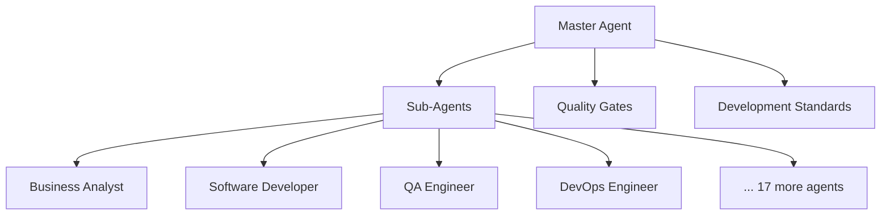

# Agentic SDLC Framework

A production-ready Human-in-the-Loop (HITL) software development lifecycle framework that orchestrates AI agents with **mandatory human oversight** for systematic project delivery.

**🚨 CRITICAL: This framework operates under HITL protocols - AI agents coordinate WITH humans, requiring approval at all quality gates!**

[](https://github.com/LinoGoncalves/agentic-framework/releases)
[](https://www.python.org/downloads/)
[](https://opensource.org/licenses/MIT)
[](https://github.com/LinoGoncalves/agentic-framework/issues)

## 📦 Installation

### ✅ Recommended: Virtual Environment (Avoids PATH Issues)

```bash
# Create and activate virtual environment
python -m venv agentic-env

# Windows:
agentic-env\Scripts\activate

# macOS/Linux:
source agentic-env/bin/activate

# Install agentic-framework
pip install git+https://github.com/LinoGoncalves/agentic-framework.git

# Now CLI commands work without PATH issues:
agentic-new
agentic-framework init my-project
```

### 🔧 System Installation (May Require PATH Setup)

```bash
pip install git+https://github.com/LinoGoncalves/agentic-framework.git
```

**If you get "command not found" errors after installation:**

```bash
# Use the diagnostic tool
python -m agentic_framework doctor

# Or use module execution as alternative:
python -m agentic_framework new
python -m agentic_framework init my-project
```

### For Development

```bash
git clone https://github.com/LinoGoncalves/agentic-framework.git
cd agentic-framework
pip install -e ".[dev]"
```

### ⚠️ Windows PATH Notes

If you get a PATH warning during installation, the CLI commands are installed but may not be accessible from any directory. You can:

1. **Use the recommended virtual environment approach above** (prevents PATH issues)
2. **Add to PATH manually**: Add `%APPDATA%\Python\Python3XX\Scripts` to your system PATH
3. **Run with full path**: Use `python -m agentic_framework.cli` instead of `agentic-framework`

## 🚀 Quick Start

### Get Interactive Guidance (New!)

```bash
# Start the Master Agent - Interactive guide for framework usage
agentic-framework master-agent

# Or if you have PATH issues:
python -m agentic_framework master-agent
```

The Master Agent provides:
- 🚀 Quick Start Guide - Get up and running fast
- 📚 Framework Overview - Learn about capabilities  
- 🏗️ Create New Project - Guided project creation
- 📋 View Templates - Explore available templates
- ✨ Advanced Features - Domain experts, validation
- 📖 Help & Resources - Documentation and support

**⚠️ IMPORTANT: The Master Agent requires AI assistant integration (Claude, ChatGPT, etc.) to function properly - see the Getting Started guide for setup instructions. HITL protocols ensure all decisions require human approval.**

### Create Your First Project

```bash
# Interactive wizard (recommended for beginners)
agentic-new

# Or direct command for experienced users  
agentic-framework init my-web-app --type web-app

# If commands not found, use module execution:
python -m agentic_framework new
python -m agentic_framework init my-web-app --type web-app
```

### Troubleshooting Installation

```bash
# Run diagnostics to check installation
python -m agentic_framework doctor

# This will show you exactly how to fix PATH issues
```

### Navigate and Start Development

```bash
cd my-web-app
python agentic-scripts/cli.py start
```

### Available Commands

After installation, you have access to these commands:

- `agentic-framework master-agent` - **NEW!** Interactive guide and help system
- `agentic-framework init <name>` - Create a new project directly  
- `agentic-new` - Interactive project creation wizard
- `agentic-framework doctor` - Diagnose installation and PATH issues
- `agentic-framework --version` - Show version information

**Individual Command Shortcuts:**
- `agentic-master-agent` - Direct access to Master Agent guide
- `agentic-init <name>` - Quick project creation
- `agentic-doctor` - Quick diagnostics

## 🎯 What This Framework Does

Transform complex software projects into manageable, AI-assisted workflows:

- **🤖 AI Agent Orchestra**: 21 specialized agents (Business Analyst, Developer, QA, DevOps, etc.)
- **🧑‍💼 Human-in-the-Loop**: Clear handoff points where humans review and approve
- **📋 Structured Process**: From requirements to deployment with quality gates
- **🔄 Continuous Learning**: Framework improves based on project experience
- **📊 Progress Tracking**: Real-time visibility into project status

## 🏗️ Framework Components

### Core Orchestration
- **Master Agent**: Central workflow coordinator and task dispatcher  
- **21 Sub-Agents**: Domain specialists with HITL protocols
- **Quality Gates**: Automated validation at key project milestones
- **Template Library**: Pre-configured project structures and standards

### Development Standards Suite
- **Coding Standards**: Style guides, security checklists, testing strategies
- **API Design**: RESTful patterns, documentation templates, versioning
- **Cloud Architecture**: Infrastructure as Code, security policies, tagging
- **MLOps Pipeline**: Data science workflows, model deployment, monitoring

## 📁 Project Types Supported

Choose from **15+ comprehensive project templates**, including custom options:

### **🌐 Web & API Applications**
- **web-app** - Web Application (Django/Flask/FastAPI)
- **api** - REST API Service
- **dashboard** - Data Dashboard (Streamlit)
- **microservice** - Microservice Architecture

### **🤖 Data Science & ML**
- **data-science** - Data Science Research
- **ml-model** - ML Model Serving
- **data-pipeline** - Data Pipeline/ETL
- **jupyter-notebook** - Jupyter Notebook Analysis

### **🛠️ Development Tools**
- **cli** - CLI Tool
- **desktop-app** - Desktop Application (PyQt/Tkinter)
- **testing** - Testing Framework
- **devops** - DevOps/Infrastructure

### **🎯 Flexible Options**
- **custom** - Custom Project Type
- **other** - Specify your own completely custom type

**Plus:** The framework adapts to your specific needs with customizable templates and standards.

## 🏗️ Architecture Overview



## 📂 Created Project Structure

When you create a new project, you get this organized structure:

```
my-project/
├── master-agent.md              # 🎯 Master orchestration guide (ROOT LEVEL!)
├── project-brief.md             # Project requirements and planning
├── README.md                    # Project documentation
├── sub-agents/                  # AI agent specifications
│   ├── business-analyst-agent.md
│   ├── software-developer-agent.md
│   └── ... (19 more specialized agents)
├── development-standards/       # Coding standards and templates
│   ├── coding_styleguide.md
│   ├── api_design_patterns.md
│   └── ... (complete standards library)
├── templates/                   # Framework templates
│   ├── project-brief-template.md
│   ├── quality-gates.md
│   └── ... (workflow templates)
└── agentic-scripts/            # CLI tools
    └── cli.py                  # Framework automation tools
```

**Key Feature:** `master-agent.md` is placed at the project root for easy access when adding to AI context (Claude, ChatGPT, etc.)

## 🔧 Advanced Usage

### Custom Project Configuration

```python
from agentic_framework import FrameworkManager

# Initialize with custom settings
framework = FrameworkManager()
framework.init_project(
    name="my-custom-project",
    project_type="web-app",
    standards_level="enterprise",
    enable_quality_gates=True
)
```

### Integration with Existing Projects

```bash
# Add agentic framework to existing project
cd existing-project
agentic-framework enhance --add-standards --add-agents
```

## 📖 Documentation

- [Installation Guide](INSTALL.md) - Detailed setup instructions
- [Repository Structure Guide](REPOSITORY_STRUCTURE.md) - GitHub browsing vs project structure
- [Framework Management Guide](framework-management-guide.md) - Core concepts
- [Master Agent Guide](master-agent.md) - Orchestration workflows  
- [Quality Gates](quality-gates.md) - Validation and testing strategies
- [Development Standards](agentic_framework/development_standards/) - Complete standards library

## 🤝 Contributing

We welcome contributions! See our [contributing guidelines](CONTRIBUTING.md) for details on:

- Adding new sub-agents (see [agentic_framework/sub_agents/](agentic_framework/sub_agents/))
- Creating project templates  
- Improving development standards (see [agentic_framework/development_standards/](agentic_framework/development_standards/))
- Enhancing quality gates

## 📄 License

This project is licensed under the MIT License - see the [LICENSE](LICENSE) file for details.

## 🆘 Support

- **GitHub Issues**: [Report bugs or request features](https://github.com/LinoGoncalves/agentic-framework/issues)
- **Documentation**: [Full documentation](https://github.com/LinoGoncalves/agentic-framework/wiki)
- **Community**: [Discussions and Q&A](https://github.com/LinoGoncalves/agentic-framework/discussions)
